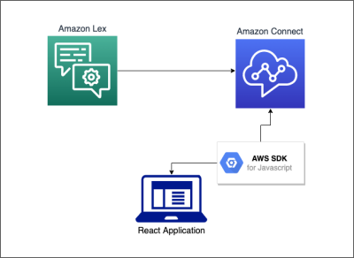

# Amazon Connect Chat UI
### Fully customize the chat experience for an [Amazon Connect](https://docs.aws.amazon.com/connect/latest/adminguide/what-is-amazon-connect.html) instance

This package contains three tools: 
1. An Amazon Connect [client](./client) based on [amazon-connect-chatjs](https://github.com/amazon-connect/amazon-connect-chatjs) that simplifies connect to a chat instance for use in React components
2. A React component library with flexible React components that can be used to build a custom Amazon Connect chat experience
3. A React-based sample widget

These tools will allow for the building of a fully customized and expandable customer experience for use with any Amazon Connect chat instance. All of the tools are built using Typescript, the client uses the AWS SDK for Javascript to connect to the instance, the component library builds upon Material UI components and uses React framework, and the sample widget is built using React. The components are styled using node-sass.

## Prerequisites
* An **AWS Account** with credentials configured to access the necessary services  
* An **Amazon Connect** instance in that account with a contact flow configured for chat. 
* The Connect instance ID and the contact flow ID need to be supplied along with the AWS account credentials in order to connect to the chat instance.
* **AWS SDK** Version 2.1 or higher</span></span></li>
* **Git** installed locally
* **NodeJS** Version 12 or higher
* *OPTIONAL* A Lex Chatbot as part of the contact flow is recommended for easier testing but not required.

## Limitations

There are two sides to the Amazon Connect chat experience: the customer side and the agent side. These tools are configured specifically for the customer side and need some further configuration in order to be used with the agent experience.  

Also, the components are built with a focus on showing how Connect-enabled components can be customized, and some chat features would need to be further configured in order to be used.

Amazon Connect also has [service quotas](https://docs.aws.amazon.com/connect/latest/adminguide/amazon-connect-service-limits.html) for chat that will affect testing and use.

## Technology Stack

* **Amazon Connect**
* **AWS Lambda**
* **Material UI**
* **AWS SDK**
* **React**
* **node-sass**

## Architecture



## Tools
* <a href="https://docs.aws.amazon.com/connect/?id=docs_gateway" rel="noopener noreferrer" target="_blank">Amazon Connect</a>: An omnichannel cloud contact center.
* <a href="https://docs.aws.amazon.com/sdk-for-javascript/v3/developer-guide/welcome.html" rel="noopener noreferrer" target="_blank">AWS SDK for Javascript</a>: provides a Javascript API for AWS services.
* <a href="https://docs.aws.amazon.com/lex/?id=docs_gateway" rel="noopener noreferrer" target="_blank">Amazon Lex</a>: An AWS service for building conversational interfaces for applications using voice and text.
* <a href="https://reactjs.org/docs/getting-started.html" rel="noopener noreferrer" target="_blank">React JS</a>: A Javascript library for building user interfaces
* <a href="https://mui.com/material-ui/getting-started/installation/" rel="noopener noreferrer" target="_blank">Material UI</a>: A React component library
* <a href="https://sass-lang.com/documentation" rel="noopener noreferrer" target="_blank">SASS</a>: A stylesheet language that compiles to CSS

## Set Up
### Add Connect Instance
* In the Amazon Connect console, click on `Add an instance`
* Under `Identity Management`:
    * Choose `Store users in Amazon Connect`
	* Under `Access URL`, input a unique name. The instance will be located at `<unique-name>.my.connect.aws`
* Under `Add administrator`, create the user who will be able to access the connect instance
* Uncheck all boxes in `Telephony Options`
* Under `Data Storage`, leave all defaults and click `Next`
* Click `Create Instance`
* Once the instance is created, find the `Instance ARN` and record the string of characters after "`instance/`" - this is your `Instance Id`

### Create Lex Chatbot (Optional)
* In the Amazon Lex console, click `Create bot`
* If you're unfamiliar with Lex, you can choose an example configuration to start with.
* Under `Bot Configuration`, choose a name for the bot
* Under `Iam Permissions`, create a role with basic Amazon Lex permissions
* Under `Children's Online Privacy Protection Act`, choose the proper response (most likely this will be `No`)
* Leave other selections at their defaults and click `Next`
* Under `Add language to bot`, select all languages the bot should speak. If English is the only language needed, leave the default settings and click `Done`
* If you chose an example configuration to start with, the defaults should suffice. Otherwise configure the bot's [Intents and Slot Types](https://docs.aws.amazon.com/lexv2/latest/dg/howitworks-builtins-intents.html?icmpid=docs_console_unmapped).
* Click `Build` and wait for the bot to complete building.

### Add Contact Flow
* Navigate to the Access URL created for the Connect instance and log in using the user credentials from Step 1.
* In the sidebar, navigate to **Routing->Contact flows**
* Get the Contact Flow ID of the contact flow you'd like to use. If you're not using Lex, "`Sample Inbound Flow`" is a good one to choose.
* If you're using a Lex chatbot:
    * Open the contact flow template in the `assets` directory of the Chat UI package and replace "`newbot`" with the name of your chatbot.
	* Click `Create Contact Flow`, then click the arrow next to the `Save` button. Choose `Import flow` and upload and import the template
	* Save and publish the Contact Flow and get the Contact Flow ID for the newly created flow.

### Create Local Environment  

* From your local command line run the following commands:  
```console
cd path/to/parent/directory

git clone https://gitlab.aws.dev/sguggenh/amazon-connect-chatui.git

npm install
```

* In the Chat UI repository, navigate to `source/example/env/development.ts`
* Input your `instanceId`, `contactFlowId`, and AWS account credentials in the fields indicated. Under `displayName`, add a name for the chatting customer.
* On the command line run `npm start`
* The default sample widget will appear in your local environment.

## Related Resources
* <a href="https://docs.aws.amazon.com/connect/?id=docs_gateway" rel="noopener noreferrer" target="_blank">Amazon Connect</a>
* <a href="https://github.com/amazon-connect/amazon-connect-chatjs" rel="noopener noreferrer" target="_blank">Amazon Connect Chat JS</a>
* <a href="https://docs.aws.amazon.com/sdk-for-javascript/v3/developer-guide/welcome.html" rel="noopener noreferrer" target="_blank">AWS SDK for Javascript</a>
* <a href="https://docs.aws.amazon.com/lex/?id=docs_gateway" rel="noopener noreferrer" target="_blank">Amazon Lex</a>

## Security

See [CONTRIBUTING](CONTRIBUTING.md#security-issue-notifications) for more information.

## License

This library is licensed under the MIT-0 License. See the LICENSE file.

